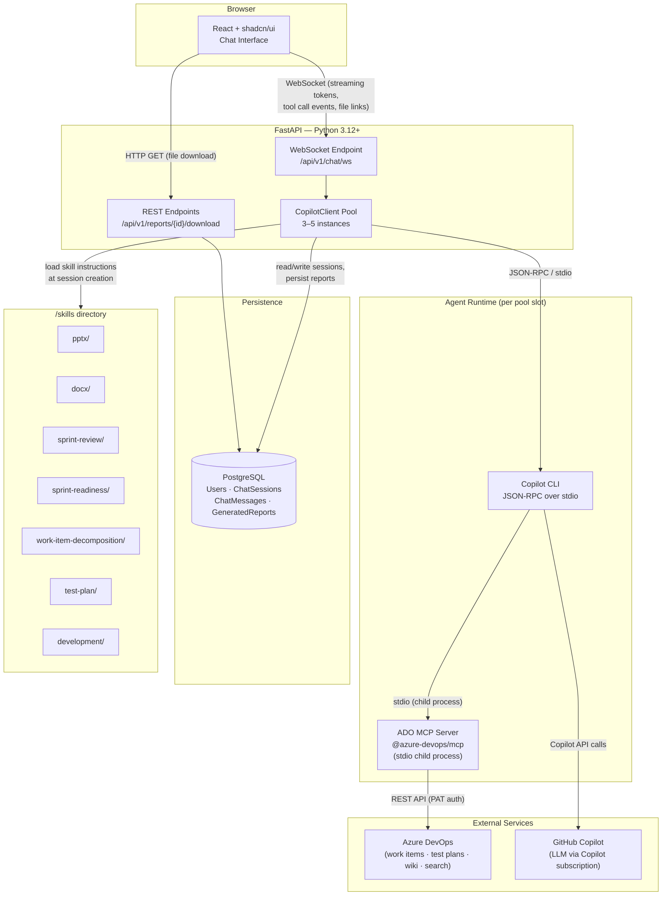
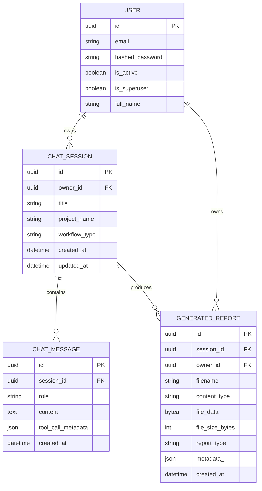
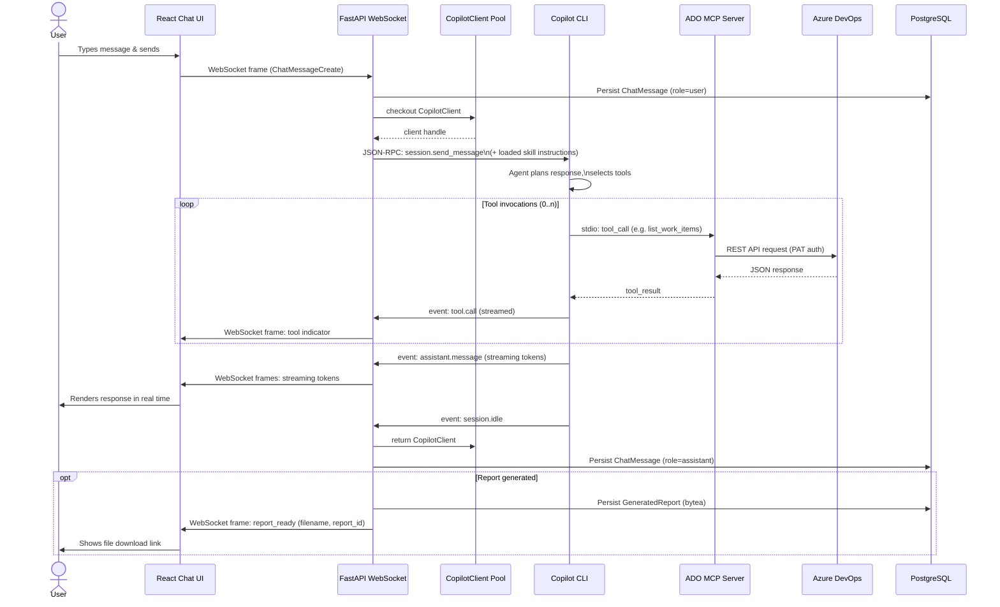
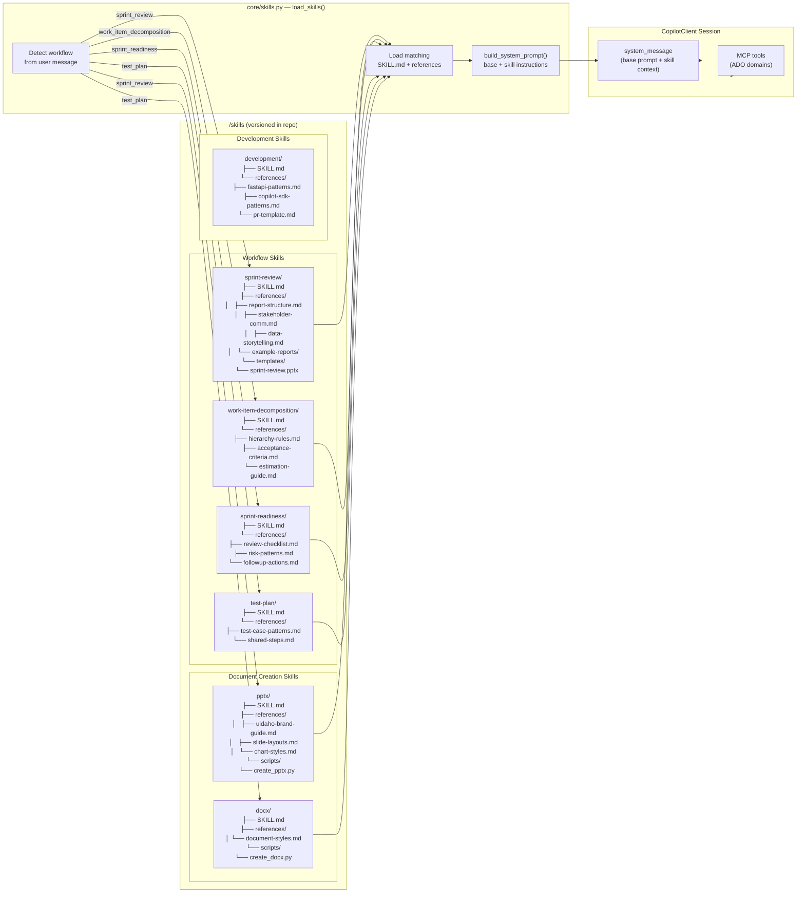
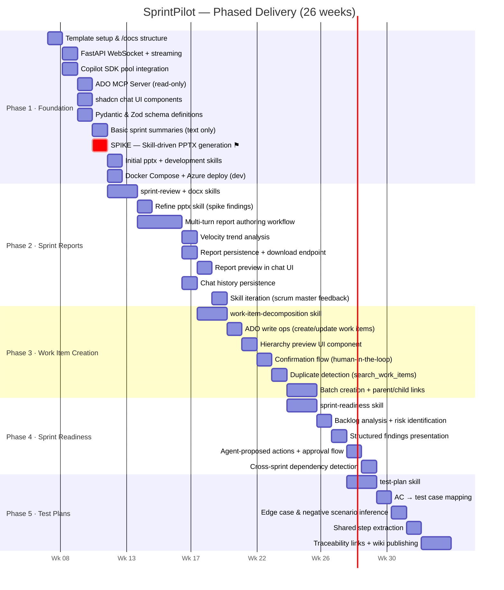
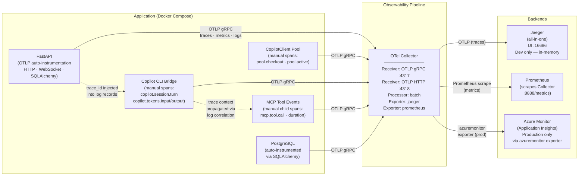

# SprintPilot — Architecture Diagrams

> Generated from `SprintPilot-PRD.md` v0.1.0

---

## 1. System Architecture

End-to-end view of all runtime layers, from the browser through FastAPI, the pooled CopilotClient, Copilot CLI, and the ADO MCP server, plus the supporting PostgreSQL store and the `/skills` directory.

---

## 2. Entity Relationship Diagram

Extends the FastAPI full-stack-template's existing `User` model. New entities are `ChatSession`, `ChatMessage`, and `GeneratedReport`.

> **`role`** values: `user` · `assistant` · `tool`
> **`report_type`** values: `sprint_review` · `work_item_export` · `test_plan_export`
> **`workflow_type`** values: `sprint_review` · `work_item_decomposition` · `sprint_readiness` · `test_plan`

---

## 3. Request Flow — WebSocket Chat Turn

Sequence from user message through FastAPI, the CopilotClient pool, Copilot CLI, and ADO MCP server, back to the browser as streaming tokens.

---

## 4. Skills Architecture — Dynamic Loading

How skills are structured on disk and composed into the agent's system prompt at session creation, based on the detected workflow.

---

## 5. Phased Delivery Timeline

Five delivery phases across 26 weeks, showing the progression from foundation through sprint reports, work item creation, readiness review, and test plans.

> **⚑ Decision gate:** The Phase 1 PPTX spike (ADR-0006) must pass a quality bar before Phase 2 skill-driven report authoring proceeds. If it doesn't meet the bar, Phase 2 falls back to deterministic templates.

---

---

## 6. Observability Architecture

How OpenTelemetry signals flow from each instrumented component through the Collector to Jaeger (dev) and Azure Monitor (production). See ADR-0008.

**Key instrumented spans:**

| Span | Parent | Key Attributes |
|---|---|---|
| `http.server` / `websocket` | root | `http.method`, `http.route`, `user.id` |
| `chat.turn` | websocket | `session.id`, `workflow.type` |
| `pool.checkout` | chat.turn | `pool.wait_ms`, `pool.size` |
| `copilot.session.turn` | pool.checkout | `copilot.model`, `tokens.input`, `tokens.output` |
| `mcp.tool.call` | copilot.session.turn | `tool.name`, `ado.project`, `duration_ms` |
| `report.generate` | chat.turn | `report.type`, `report.size_bytes` |
| `db.query` | (any) | Auto — table, operation, duration |

---

## Diagram Index

| # | Diagram | Type | Key Insight |
|---|---|---|---|
| 1 | System Architecture | Flowchart | Stdio all the way down: FastAPI → CopilotClient pool → Copilot CLI → ADO MCP Server |
| 2 | Entity Relationship | ER | Extends template `User`; three new models: `ChatSession`, `ChatMessage`, `GeneratedReport` |
| 3 | Request Flow | Sequence | WebSocket chat turn with tool invocation loop and optional report persistence |
| 4 | Skills Architecture | Flowchart | Dynamic skill loading based on detected workflow; skills are loaded into `system_message` |
| 5 | Phased Delivery | Gantt | 26-week roadmap; Phase 1 PPTX spike gates Phase 2 approach |
| 6 | Observability Architecture | Flowchart | OTel signals → Collector → Jaeger (dev) / Azure Monitor (prod); key span inventory |
